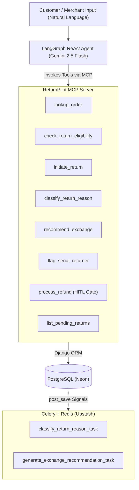

# ReturnPilot

> **AI-powered eCommerce returns management platform with an MCP server and LangGraph ReAct agent that enables automated returns processing, exchange recommendations, behavioral fraud risk scoring, and policy enforcement through natural language.**

---

## Architecture Overview



---

## Tech Stack

| Layer | Technology |
|---|---|
| **Backend Framework** | Django 5.x + Django REST Framework |
| **Database** | PostgreSQL (Neon serverless) |
| **MCP Server** | Python `mcp` SDK (Model Context Protocol), stdio + SSE transports |
| **Agent Framework** | LangGraph (ReAct agent state graph with memory checkpointing) |
| **LLM Reasoning** | Google Gemini 2.5 Flash via Vertex AI |
| **Async Tasks & Queue** | Celery + Redis (Upstash) |
| **Frontend** | React (Vite) + Tailwind CSS + Lucide Icons + Recharts |
| **Package Manager** | `uv` (Fast resolver + deterministic `uv.lock`) |
| **Production Deployment** | Railway (Gunicorn Web + Celery Worker) |

---

## MCP Server Tools (8 Tools)

The ReturnPilot MCP server exposes 8 domain tools for returns management:

| Tool | Signature | Description |
|---|---|---|
| `lookup_order` | `(order_id: str) -> dict` | Lookup order details, items, delivery timeline, customer profile, and prior return history. |
| `check_return_eligibility` | `(order_id: str, item_skus: list[str]) -> dict` | Evaluate return window compliance and category-specific conditions. |
| `initiate_return` | `(order_id: str, item_skus: list[str], reason: str) -> dict` | Create return requests with free-text customer reasons and line items. |
| `classify_return_reason` | `(return_id: str) -> dict` | Classify customer return intent into structured categories (`sizing`, `defective`, `changed_mind`, etc.). |
| `recommend_exchange` | `(return_id: str) -> dict` | Suggest catalog alternatives (sizes/colors/similar products) and incentives to prevent return churn. |
| `flag_serial_returner` | `(customer_email: str) -> dict` | Compute return frequency, return-to-order ratio, and behavioral risk scores. |
| `process_refund` | `(return_id: str, decision: str, method: str, reason: str) -> dict` | Process refunds with automated Human-In-The-Loop (HITL) gate triggers for high-value ($>100) or high-risk ($>0.75) requests. |
| `list_pending_returns` | `(status_filter: str, limit: int) -> dict` | Query and filter the merchant review queue by lifecycle status. |

---

## Claude Desktop Configuration

To connect ReturnPilot MCP tools to Claude Desktop, add the following configuration to `claude_desktop_config.json`:

```json
{
  "mcpServers": {
    "ReturnPilot": {
      "command": "uv",
      "args": ["run", "python", "manage.py", "run_mcp_server"],
      "cwd": "/path/to/ReturnPilot"
    }
  }
}
```

---

## API Endpoints

### Core REST APIs
- `GET /api/products/` — List & retrieve catalog products
- `GET /api/customers/` — List & retrieve customer risk profiles
- `GET /api/orders/` — List & retrieve orders with line items
- `GET /api/returns/` — Filterable return requests queue
- `GET /api/policies/` — Category return policies
- `GET /api/refunds/` — Immutable audit refund ledger
- `GET /api/analytics/` — Aggregated return analytics & KPIs
- `POST /api/webhooks/shopify/` — Mock Shopify webhook ingestion endpoint

### Agent & HITL APIs
- `POST /api/agent/chat/` — Send natural language queries to the LangGraph ReAct agent
- `POST /api/agent/approve/` — Submit merchant approval/rejection for HITL-flagged returns
- `GET /api/agent/sessions/` — List active agent conversation threads

---

## Local Development Setup

### 1. Prerequisites
- Python 3.10+
- `uv` package manager (`curl -LsSf https://astral.sh/uv/install.sh | sh` or `winget install astral-sh.uv`)
- Node.js 18+ and `npm`

### 2. Clone and Install Dependencies
```bash
git clone https://github.com/santhosh803/ReturnPilot.git
cd ReturnPilot

# Install backend dependencies with uv
uv sync

# Install frontend dependencies
cd frontend && npm install && cd ..
```

### 3. Environment Variables
Copy `.env.example` to `.env` and provide your credentials:
```bash
cp .env.example .env
```

### 4. Database Setup & Seeding
```bash
# Run migrations
uv run python manage.py migrate

# Seed demo dataset (6 policies, 50 products, 100 customers, 200 orders, 30 returns)
uv run python manage.py seed_data
```

### 5. Running the Application
In separate terminal tabs:

```bash
# 1. Django API & Backend Server
uv run python manage.py runserver 8000

# 2. Celery Async Task Worker
uv run celery -A returnpilot worker --loglevel=info

# 3. MCP Server (SSE Mode for agent)
uv run python manage.py run_mcp_server --transport sse --port 8001

# 4. React Frontend (Vite)
cd frontend && npm run dev
```

Visit the dashboard at `http://localhost:5173`.

---

## Railway Production Deployment

1. Connect your GitHub repository to **Railway**.
2. Add the following environment variables in the Railway dashboard:
   - `DATABASE_URL`: Your Neon PostgreSQL connection string.
   - `REDIS_URL`: Your Upstash Redis connection string.
   - `GCP_CREDENTIALS_JSON`: The JSON content of your Google Cloud service account key.
   - `GOOGLE_CLOUD_PROJECT`: `your-gcp-project-id`
   - `GOOGLE_CLOUD_LOCATION`: `us-central1`
   - `DJANGO_SECRET_KEY`: Secure random secret key.
   - `RAILWAY_ENVIRONMENT`: `production`
3. Railway automatically detects the `Procfile` and launches the web process (`gunicorn`) and worker process (`celery`).
4. Run migrations and seed data via the Railway CLI or one-off command:
   ```bash
   python manage.py migrate
   python manage.py seed_data
   ```
